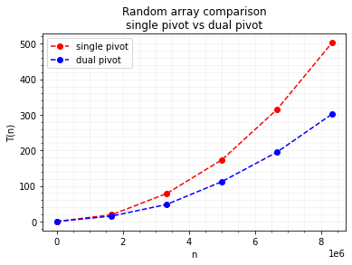
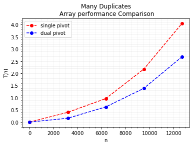
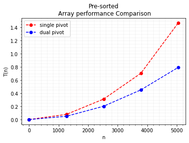

<details>
  <summary>Importering og tidsmålingskode</summary>
  
  
  ```javascript
  console.log("I'm a code block!");
  ```
  


```python
from IPython.display import HTML, display
import tabulate
from random import randrange
import matplotlib.pyplot as plt
import numpy as np
import sys
import time
sys.setrecursionlimit(round(10**6))

def setupPlot():
    plt.minorticks_on()
    plt.grid(b=True, which='both',color='#D3D3D3', linestyle='-', alpha=0.3)
    plt.legend(loc="upper left")
    plt.ylabel('T(n)')
    plt.xlabel('n')
    
def flushPrintLine():
    print(f"                                                                 ",end='\r')
```

## Kode for tidsmålinger


```python
def take_time_of(function, args):
    
    start = time.time()
    time_taken = 0
    repeats=0
    min_accuracy = 0.1
    
    while True:
        function(*args)
    
        repeats = repeats + 1
        time_taken = time.time() - start
        if time_taken > min_accuracy: break
    
    return time_taken / repeats 
```


```python
def compare(functions, names, gen_args, **kwargs):

#   initialize vars
    total_steps = kwargs.get('steps', 5)
    scale = kwargs.get('scale', 3)
    max_operations = round(10**scale)
    step_length = max_operations / total_steps
    operations = [round(s * step_length) for s in range(total_steps)]   
    
    results = []
    colors = ['r','b','g','c','m','y']
 
    
#   going trough every function  
    for i in range(len(functions)):
        
#       calculate times at different (n) complexities
        data = []
        for step in range(total_steps):
            
            n = operations[step]
            arguments = gen_args(n)
            function = functions[i]
         
            print(f"Loading: {names[i]} | {step}/{total_steps} | n = {n}",end='\r')
            
            data.append( take_time_of(function, arguments) )
            
        plt.plot(operations, data, colors[i] + 'o--', label=names[i])
        results.append(data)
    
#   remove loading text
    flushPrintLine()
    
#   display plot
    if 'title' in kwargs: plt.title(kwargs.get('title'))
    setupPlot()
    plt.show()
    
#   display table with data
    headers = ["Operations", *names]
    data = zip(operations, *results)
    display(HTML(tabulate.tabulate(data, headers, tablefmt='html')))
```

</details>

## Single pivot quicksort


```python
def quicksort(arr):

    length = len(arr)
    
    if length < 2: return arr
    
#   pick first element as pivot
    pivot_position = 0
    pivot = arr.pop(pivot_position)
    
    less_than_pivot = []
    more_than_pivot = []
    
    for i in arr:
        if i < pivot: less_than_pivot.append(i)
        else:         more_than_pivot.append(i)
            
    return quicksort(less_than_pivot) + [pivot] + quicksort(more_than_pivot)
```

## Dual pivot quicksort


```python
def dp_quicksort(arr):

    length = len(arr)
    
    if length < 2: return arr

    piv_a_pos = 0
    piv_a = arr.pop(piv_a_pos)
    
    piv_b_pos = length-2
    piv_b = arr.pop(piv_b_pos)

#   swap values if pivot A is bigger than B
    if piv_b < piv_a:
        piv_a_pos, piv_b_pos = piv_b_pos, piv_a_pos
        piv_a, piv_b = piv_b, piv_a
    
    less_than_piv = []
    between_piv = []
    more_than_piv = []
    
    for i in arr:
        if piv_a < i < piv_b: between_piv.append(i)
        elif piv_b <= i: more_than_piv.append(i)
        else: less_than_piv.append(i)
    
    return dp_quicksort(less_than_piv) + [piv_a] + dp_quicksort(between_piv) + [piv_b] + dp_quicksort(more_than_piv)
```

# Tidsmålinger
I dette arbeidskravet er to varianter av quicksort (single-pivot og dualpivot) sammenlignet med forskjellige type arrays

## Tilfeldige Tall Array Tidsmålinger


```python
def random_list(n):
    return [[round(randrange(n)) for i in range(n)]]


compare([quicksort,dp_quicksort],
        ["single pivot","dual pivot"],
        random_list,
        scale= 8, steps= 5, title="Random\n Array performance Comparison")
```

                                                                     





<table>
<thead>
<tr><th style="text-align: right;">  Operations</th><th style="text-align: right;">  single pivot</th><th style="text-align: right;">   dual pivot</th></tr>
</thead>
<tbody>
<tr><td style="text-align: right;">           0</td><td style="text-align: right;">   8.37386e-07</td><td style="text-align: right;">  8.69985e-07</td></tr>
<tr><td style="text-align: right;">     1666667</td><td style="text-align: right;">  19.0929     </td><td style="text-align: right;"> 15.2938     </td></tr>
<tr><td style="text-align: right;">     3333333</td><td style="text-align: right;">  78.7612     </td><td style="text-align: right;"> 48.0337     </td></tr>
<tr><td style="text-align: right;">     5000000</td><td style="text-align: right;"> 173.503      </td><td style="text-align: right;">112.114      </td></tr>
<tr><td style="text-align: right;">     6666667</td><td style="text-align: right;"> 314.947      </td><td style="text-align: right;">194.978      </td></tr>
<tr><td style="text-align: right;">     8333333</td><td style="text-align: right;"> 502.798      </td><td style="text-align: right;">302.069      </td></tr>
</tbody>
</table>


## Mange duplikater Array Tidsmålinger


```python
def duplicates_list(n):
    return [[ i if i%2 == 0 else 13 for i in range(n)]]

compare([quicksort,dp_quicksort],
        ["single pivot","dual pivot"],
        duplicates_list,
        scale=4.2, title="Many Duplicates\n Array performance Comparison")
```

                                                                     





<table>
<thead>
<tr><th style="text-align: right;">  Operations</th><th style="text-align: right;">  single pivot</th><th style="text-align: right;">  dual pivot</th></tr>
</thead>
<tbody>
<tr><td style="text-align: right;">           0</td><td style="text-align: right;">   3.81465e-07</td><td style="text-align: right;">  3.6598e-07</td></tr>
<tr><td style="text-align: right;">        3170</td><td style="text-align: right;">   0.399263   </td><td style="text-align: right;">  0.15655   </td></tr>
<tr><td style="text-align: right;">        6340</td><td style="text-align: right;">   0.965075   </td><td style="text-align: right;">  0.621708  </td></tr>
<tr><td style="text-align: right;">        9509</td><td style="text-align: right;">   2.17623    </td><td style="text-align: right;">  1.38529   </td></tr>
<tr><td style="text-align: right;">       12679</td><td style="text-align: right;">   4.04582    </td><td style="text-align: right;">  2.6787    </td></tr>
</tbody>
</table>


## Forhåndssortert Array Tidsmålinger


```python
def sorted_list(n):
    return [list(range(n))]

compare([quicksort,dp_quicksort],
        ["single pivot","dual pivot"],
        sorted_list,
        scale=3.8, steps = 5, title="Pre-sorted\n Array performance Comparison")
```

                                                                     





<table>
<thead>
<tr><th style="text-align: right;">  Operations</th><th style="text-align: right;">  single pivot</th><th style="text-align: right;">  dual pivot</th></tr>
</thead>
<tbody>
<tr><td style="text-align: right;">           0</td><td style="text-align: right;">   3.75436e-07</td><td style="text-align: right;"> 3.72501e-07</td></tr>
<tr><td style="text-align: right;">        1262</td><td style="text-align: right;">   0.0782903  </td><td style="text-align: right;"> 0.0495447  </td></tr>
<tr><td style="text-align: right;">        2524</td><td style="text-align: right;">   0.311315   </td><td style="text-align: right;"> 0.202458   </td></tr>
<tr><td style="text-align: right;">        3786</td><td style="text-align: right;">   0.703709   </td><td style="text-align: right;"> 0.451234   </td></tr>
<tr><td style="text-align: right;">        5048</td><td style="text-align: right;">   1.46812    </td><td style="text-align: right;"> 0.792434   </td></tr>
</tbody>
</table>


## Tidsmålinger Sammenlignet


```python
n = 5000

array_types = [random_list, duplicates_list, sorted_list]
args = [array_types[i](n) for i in range(len(array_types))]

headers = ["Array type", "Single pivot", "Dual pivot"]
arr_type = ["Random", "Duplicates", "Sorted"]
single_piv = [ round(take_time_of(quicksort, a),4) for a in args ]
dual_piv = [ round(take_time_of(dp_quicksort, a),4) for a in args ]

display(HTML(tabulate.tabulate(zip(arr_type, single_piv, dual_piv), headers, tablefmt='html')))
```


<table>
<thead>
<tr><th>Array type  </th><th style="text-align: right;">  Single pivot</th><th style="text-align: right;">  Dual pivot</th></tr>
</thead>
<tbody>
<tr><td>Random      </td><td style="text-align: right;">        0.0096</td><td style="text-align: right;">      0.0081</td></tr>
<tr><td>Duplicates  </td><td style="text-align: right;">        0.6031</td><td style="text-align: right;">      0.383 </td></tr>
<tr><td>Sorted      </td><td style="text-align: right;">        1.2109</td><td style="text-align: right;">      0.7742</td></tr>
</tbody>
</table>


## Konklusjoner
Som forventet er min enkle quicksort algoritme ikke optimalisert og har derfor værre ytelse på den forhåndssorterte og mange duplikater array, imens en array med tilfeldige tall har mye bedre ytelse. Vi ser også at dual-pivot slår ut single-pivot variasjonen etter array størrelsen blir tilstrekkelig mye større.

-------------
## Beståtte Tester


```python
def test_function(name,func,list_gen_args,tests):
    n = 10**2
    
    results = []
    for test in tests:
        for gen_args in list_gen_args:
            args = gen_args(n)
            passed = test(func, *args)
            if not passed:
                print(f"❌ {name} failed")
                return
            
    print(f"✅ {name} passed")
```


```python
def checksum(func, arr):
    return sum(arr) == sum(func(arr))

def checkorder(func, arr):
    sort = func(arr)
    for i in range(len(arr) - 1): 
        if sort[i+1] < sort[i]: 
            return False
    
    return True

tests = [checksum, checkorder]
list_types = [random_list,duplicates_list,sorted_list]
test_function("Single pivot quicksort",quicksort, list_types, tests)
test_function("Dual pivot quicksort",dp_quicksort, list_types, tests)
```

    ✅ Single pivot quicksort passed
    ✅ Dual pivot quicksort passed
    
